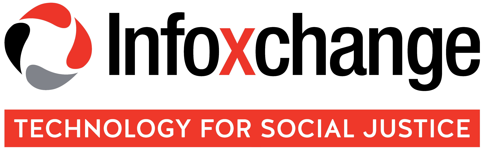

# BrisPHP Meetup 🐘

This is where you can request a talk topic, or propose a talk you would like to present. To see details of our next meetup, view our [Meetup Page](https://www.meetup.com/BrisPHP/).

**⭐️Star this repo to stay up to date with what's happening in the community ⭐️**

## Community

* Do you want to see a talk? 
* Did you have a talk you wanted to give?
* Are you looking to hire?
* Are you looking for help?

[Contribute to our community](https://github.com/BrisPHP/meetups/issues/new)! You will go into the draw to win a [Knp University](https://knpuniversity.com/) voucher, we give away one at every meetup.

## Past Talks

Materials from past talks (slides/videos) will be posted [on their GitHub issue](https://github.com/BrisPHP/meetups/issues?utf8=%E2%9C%93&q=is%3Aissue+label%3A%22Talk+Finalised%22+).

## Sponsors

The BrisPHP Meetup has three amazing sponsors which all provide venues, food and drinks on a rotating basis.

[CreditSense - Transaction analysis that makes sense](https://creditsense.com.au/)

[neto - All-in-one ecommerce, poit of sale, inventory and fulfilment solution](https://www.neto.com.au/)

[Infoxchange - Delivering technology for social justice for 30 years](https://www.infoxchange.org/au)

## Code of conduct

View our Code of Conduct [here](./code-of-conduct.md)

